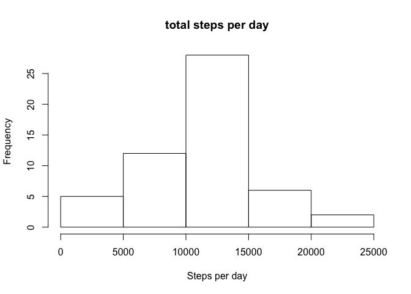
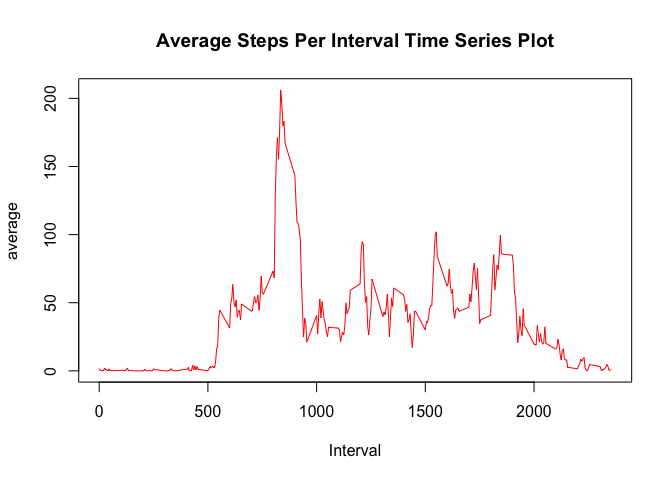
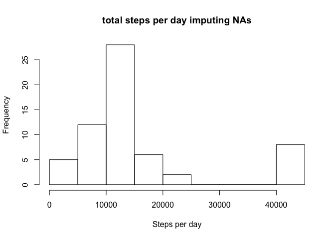
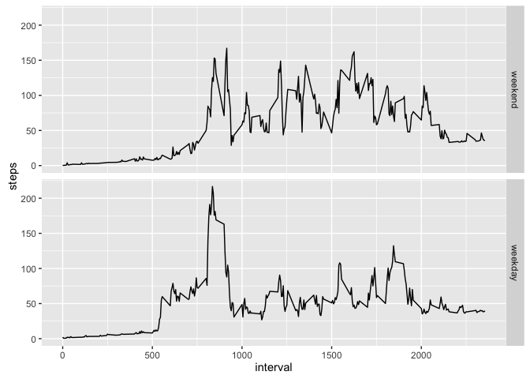

# Reproducible Research: Peer Assessment 1


## Loading and preprocessing the data

```r
setwd("~/Downloads")
activity <- read.csv("activity.csv",header = T, na.strings = "NA",stringsAsFactors = FALSE)
```


## What is mean total number of steps taken per day?

```r
act1 <- activity[complete.cases(activity),]
ans1 <-tapply(act1$steps,act1$date,FUN = sum)
hist(ans1,main = 'total steps per day',xlab = 'Steps per day')
```

<!-- -->

```r
avg <- mean(ans1); me <- median(ans1)
```
The mean of the total number of steps taken per day is 1.0766189\times 10^{4} and median of the total number of steps taken per day is 10765. 


## What is the average daily activity pattern?

```r
ans <- as.matrix(tapply(act1$steps,act1$interval,FUN = mean))
plot(row.names(ans),ans,type = 'l',col = 'red',xlab = 'Interval',ylab = 'average', main = 'Average Steps Per Interval Time Series Plot')
```

<!-- -->

Which 5-minute interval, on average across all the days in the dataset, contains the maximum number of steps?

```r
ans1 <- rownames(ans)[which(ans == max(ans))]
```
The 835 5-minute interval, on average across all the days in the dataset, contains the maximum number of steps. 


## Imputing missing values

```r
total_miss <- sum(as.numeric(is.na(activity)))
```
The total number of missing values in the dataset is 2304


```r
miss_val <- as.data.frame(is.na(activity))
miss_list <- activity[which(miss_val$steps == TRUE),]
# make interval list
interval_list<-as.integer(rownames(ans))
l_list <- cbind(ans,interval_list)
l_list <- as.data.frame(l_list)

# make miss list and combined together by using mean of each interval
miss_list$steps <- as.numeric(ordered(miss_list$interval,levels = l_list$interval_list,
                           labels = as.integer(l_list$V1)))
```

```
## Warning in `levels<-`(`*tmp*`, value = if (nl == nL) as.character(labels)
## else paste0(labels, : duplicated levels in factors are deprecated
```

```r
miss_list$steps <- as.numeric(miss_list$steps)
com_list <- rbind(miss_list,act1,stringsAsFactors = FALSE) # new dataset with imputing number

ans3 <- aggregate(com_list$steps,by = list(Date = com_list$date),FUN = sum)
hist(ans3[,2],main = 'total steps per day imputing NAs',xlab = 'Steps per day')
```

<!-- -->

4.Calculate and report the mean and median total number of steps taken per day. Do these values differ from the estimates from the first part of the assignment? What is the impact of imputing missing data on the estimates of the total daily number of steps?

```r
avg_new<- mean(ans3[,2]); me_new<-median(ans3[,2])
```
answer: The value is different. Mean is 1.4812066\times 10^{4} and median is 1.1458\times 10^{4}
Since the total number is increased, but not very much. The missing value would somehow decrease the value of total daily number of steps.

## Are there differences in activity patterns between weekdays and weekends?
1.Create a new factor variable in the dataset with two levels – “weekday” and “weekend” indicating whether a given date is a weekday or weekend day.

```r
library(lubridate)
```

```
## 
## Attaching package: 'lubridate'
```

```
## The following object is masked from 'package:base':
## 
##     date
```

```r
com_list$date <- as.Date(com_list$date)
#create a vector of weekdays
weekdays1 <- c('Monday', 'Tuesday', 'Wednesday', 'Thursday', 'Friday')

com_list$wDay <- factor((weekdays(com_list$date) %in% weekdays1), 
         levels=c(FALSE, TRUE), labels=c('weekend', 'weekday'))
```

2.Make a panel plot containing a time series plot (i.e. 𝚝𝚢𝚙𝚎 = "𝚕") of the 5-minute interval (x-axis) and the average number of steps taken, averaged across all weekday days or weekend days (y-axis). See the README file in the GitHub repository to see an example of what this plot should look like using simulated data.

```r
library(ggplot2)
ans4 <- aggregate(steps~interval+wDay, com_list,mean)
g <- ggplot(ans4,aes(interval,steps))+ geom_line()
g + facet_grid(wDay~.) 
```

<!-- -->
